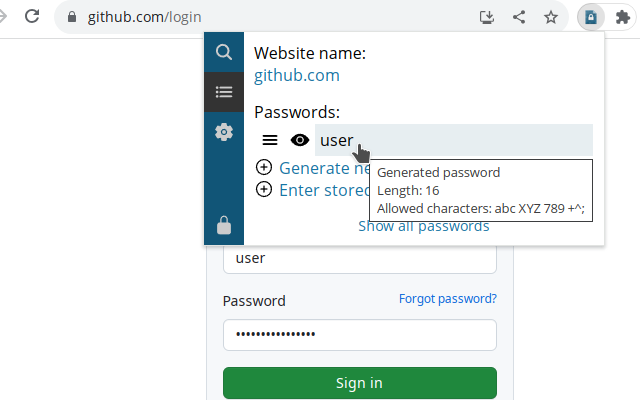

Adrium Easy Pass
================

[Download from Chrome Web Store](https://chrome.google.com/webstore/detail/adrium-easy-pass/ebigikdfolbipomeaknpooibomohhhhk)

This is a fork of [PfP: Pain-free Passwords](https://pfp.works).
It is possible to use multiple master passwords and use drag-and-drop for passwords to other applications.

Differences to the original version:

* Multiple master passwords can be used
* Show the passwords concealed to use drag and drop
* Smaller theme with accent color
* Sync works, but disabled due to missing API keys

Using multiple master passwords
-------------------------------

Sites and accounts are linked to your master password.
If you want to use a different master password
for different work spaces (like private and work),
you can create a new password store by entering a different password.

Select *New master password* to create a new password store.
If you enter a master password you have used previously,
the existing store will simply be opened.

Import/Export
-------------

You can import and export data that is compatible to PfP,
as the same format is used.

The backup is limited to the currently active work space (i.e master password).
Backups have to be created seperately for all work spaces.

Description
===========

Adrium Easy Pass is a Firefox, Chrome and Opera password manager. Most passwords will be generated for a specific site and account from your master password whenever needed, these passwords are never stored on disk and can be recreated easily if data is lost. For passwords that cannot be changed for some reason, storing the password with the extension data is also supported. All extension data is safely encrypted.

You can get an idea of how AEP works by using the [online version](https://adrium.github.io/easypass/). Please make sure to read the warnings when using this one!

Installing build prerequisites
------------------------------

In order to build AEP you will need to install [Node.js](https://nodejs.org/) first (Node 10.0 or higher is required). You will also need [Gulp](http://gulpjs.com/), run the following command to install it (administrator privileges required):

    npm install --global gulp-cli

Additional dependencies are installed using the following command in the extension directory:

    npm install

How to build
------------

### Firefox

The following command with produce a file with a name like `build-firefox/aep-n.n.n.xpi`:

    gulp xpi

### Chrome and Opera

The following command with produce a file with a name like `build-chrome/aep-n.n.n.zip`:

    gulp crx

This ZIP file can be uploaded to Chrome Web Store or Opera Add-ons and will be converted into a signed CRX there.

### Web client

The following command with produce a file with a name like `build-web/aep-web-n.n.n.zip`:

    gulp web

After unpacking the package, you can open `index.html` in the browser which will give you a slightly feature-reduced version of AEP.

How to test
-----------

### Firefox

The following command will create a `build-firefox` directory:

    gulp build-firefox

You can load this directory as a temporary extension in Firefox via `about:debugging` page. An already loaded extension will reload automatically on rebuild. If you want the directory to be updated automatically whenever you change any source files, you can use `gulp watch-firefox` instead.

### Chrome and Opera

The following command will create a `build-chrome` directory:

    gulp build-chrome

You can load this directory as an unpacked extension in Chrome and Opera. An already loaded extension will reload automatically on rebuild. If you want the directory to be updated automatically whenever you change any source files, you can use `gulp watch-chrome` instead.

### Web client

The following command will create a `build-web` directory:

    gulp build-web

You can then open `build-web/index.html` in your browser to test then.

Running unit tests
------------------

This repository contains an extensive test suite for the core functionality. You can run the unit tests using the following command:

    gulp test

You can also run an individual unit test file, for example:

    gulp test --test=masterPassword

Cleaning up the repository
--------------------------

You can run the following command to remove all temporary files that have been generated during build:

    gulp clean
